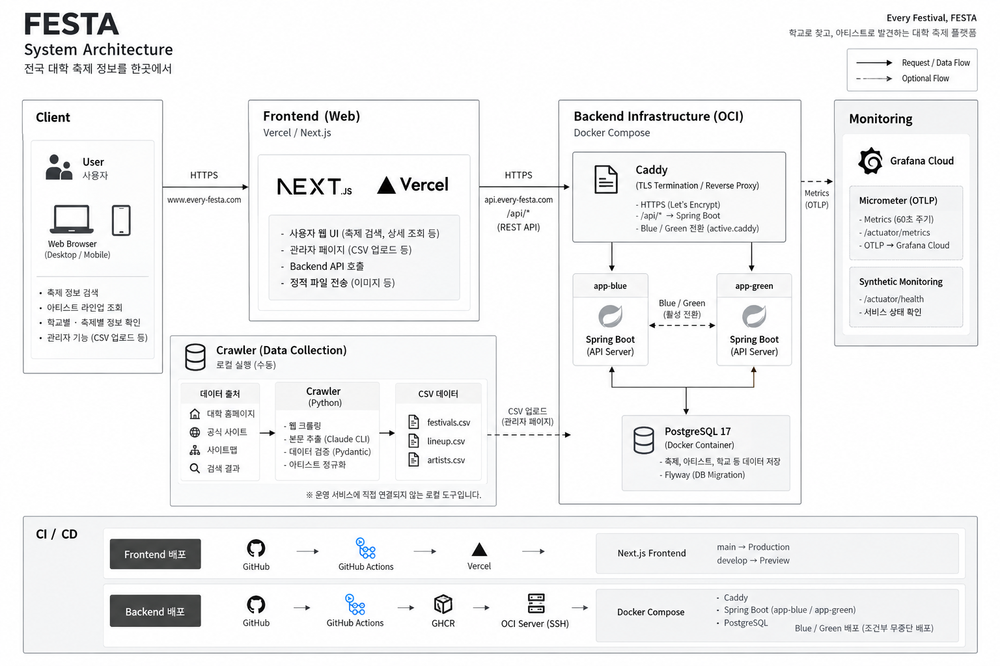
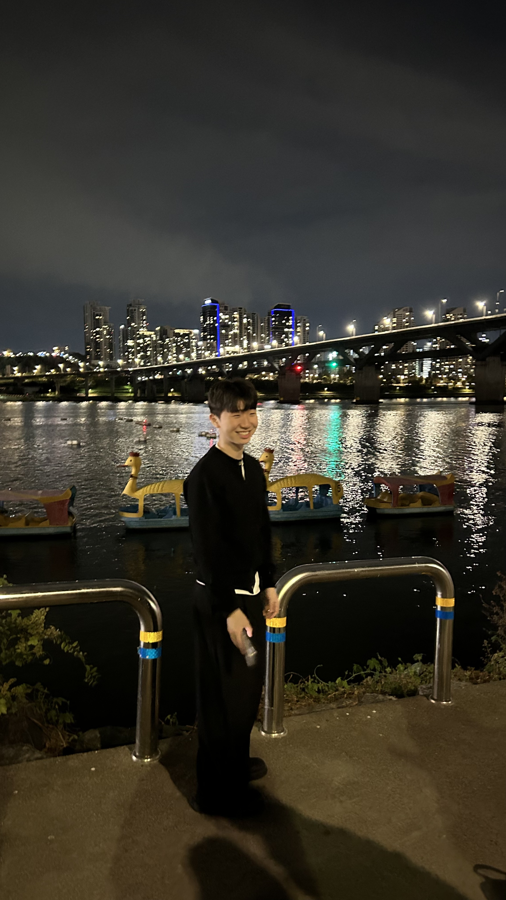
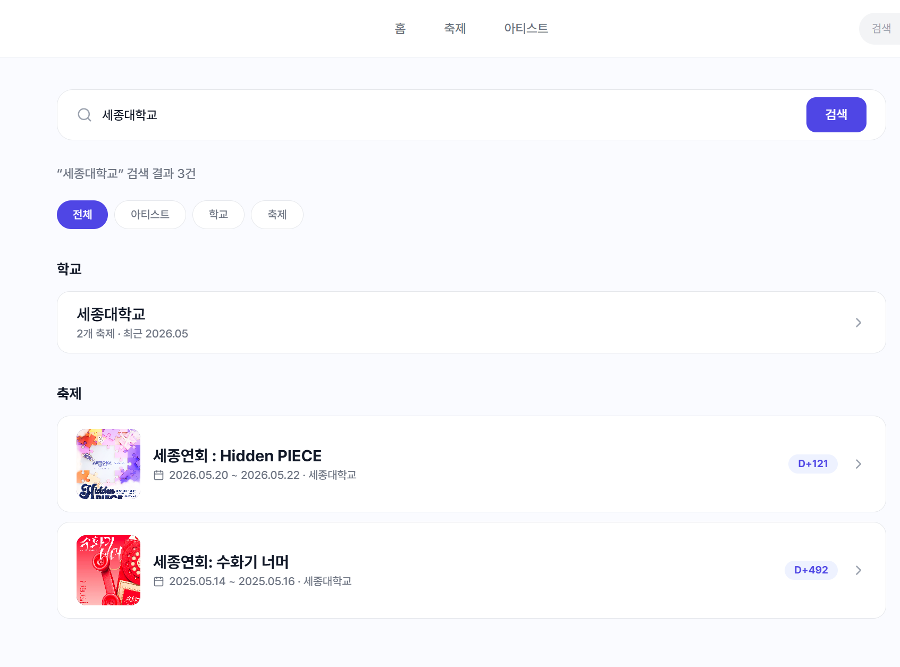
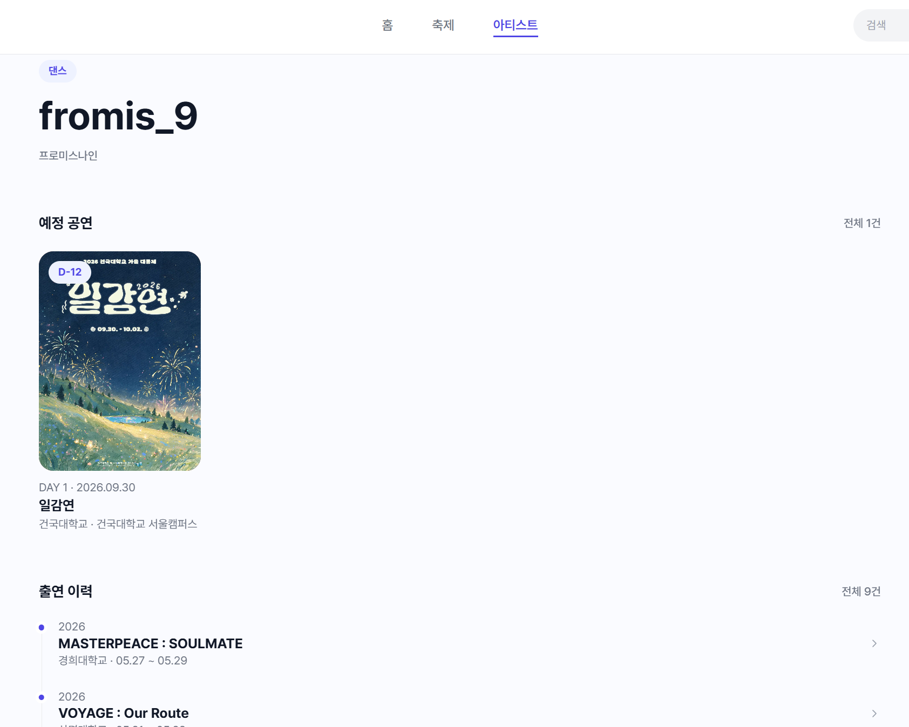
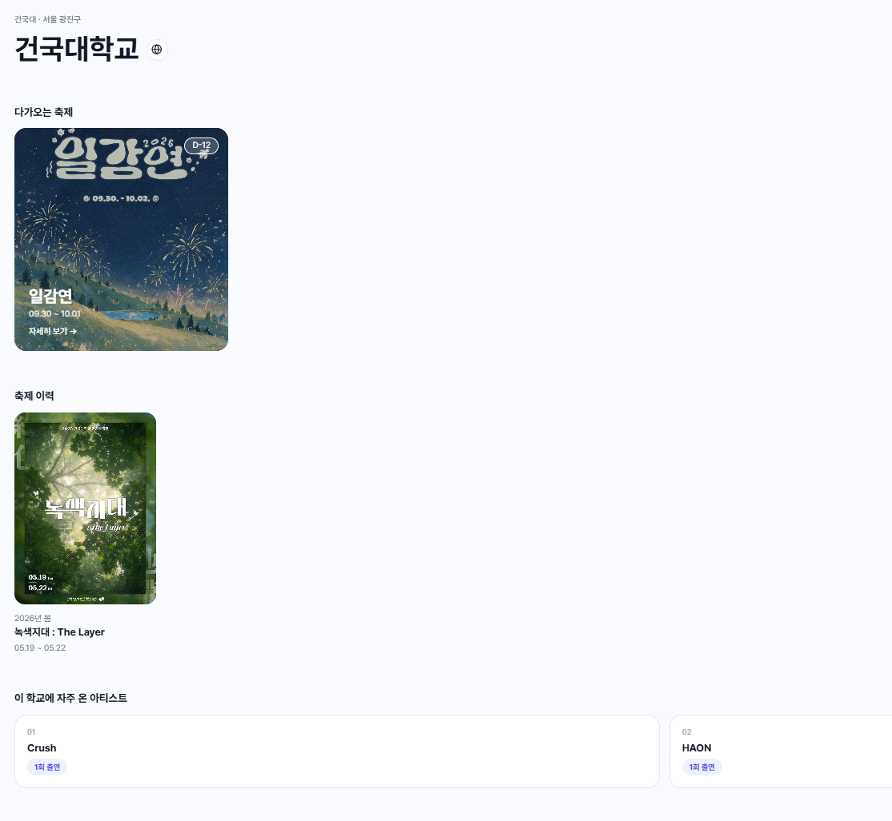
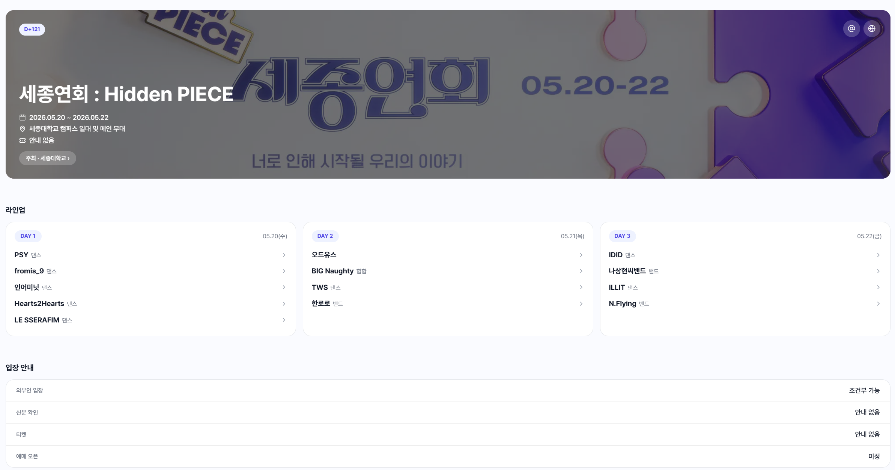

# 🎉 FESTA

### 전국 대학 축제 정보를 한곳에서

  흩어져 있는 대학 축제 정보와 아티스트 라인업을 
  한곳에서 쉽고 빠르게 확인할 수 있는 <strong>대학&nbsp;축제&nbsp;정보&nbsp;통합&nbsp;서비스입니다.</strong>

### [🎉 FESTA 바로가기](https://www.every-festa.com)

 

## 📖 서비스 소개

대학 축제 정보는 각 학교의 총학생회 SNS, 공지사항 등 여러 채널에 흩어져 있어 원하는 정보를 한 번에 확인하기 어렵습니다.

특히 좋아하는 아티스트가 **어떤 대학 축제에 출연하는지** 알고 싶다면 여러 학교의 축제 정보를 직접 찾아봐야 합니다.

**FESTA**는 흩어진 대학 축제 정보를 한곳에 모아,

-  **학교별** 축제 일정과 라인업을 확인하고
-  **아티스트별** 출연 대학 축제를 찾아보고
-  원하는 **학교·축제·아티스트를 한 번에 검색**할 수 있도록 만든 서비스입니다.

 

---

## 🛠️ Technology Stack

###  Frontend

  

**Next.js 16 · React 19 · TypeScript · Tailwind CSS · TanStack Query · Vercel**

###  Backend

  

**Java 21 · Spring Boot 4.1 · Spring Security · Spring Data JPA · PostgreSQL 17 · Flyway · Docker · Caddy · Grafana Cloud**

###  Cooperation (협업 도구)

  

**GitHub · GitHub Actions · Notion · Figma · Discord**

 

---

## ️ System Architecture

  

 

---

## 👥 Team Members

###  Front-End Team

| **홍의민** | **이규형** |
| :---: | :---: |
|  |  |
| FE Developer | FE Developer |
| 컴퓨터공학과 | 컴퓨터공학과 |

 

###  Back-End Team

| **김하은** | **정명준** |
| :---: | :---: |
|  |  |
| BE Developer | BE Developer |
| 영어영문학과 | 컴퓨터공학과 |

 

---

## ✨ 주요 기능

### 🔍 통합 검색

아티스트, 학교, 축제를 하나의 검색창에서 검색할 수 있습니다.

학교의 정식 명칭뿐만 아니라 `연대`, `고대`, `외대`, `이대` 등 실제로 자주 사용하는 대학 약어를 이용해서도 원하는 정보를 찾을 수 있습니다.

  

 

### 🎤 아티스트별 축제 정보

좋아하는 아티스트를 검색하면 해당 아티스트가 출연하는 대학 축제를 한눈에 확인할 수 있습니다.

기존의 **학교 → 라인업** 방식뿐만 아니라 **아티스트 → 대학 축제** 방향으로도 축제 정보를 탐색할 수 있습니다.

  

 

### 🏫 학교별 축제 정보

학교별로 개최되는 축제의 일정과 아티스트 라인업을 확인할 수 있습니다.

여러 대학의 축제 정보를 한곳에 모아 원하는 학교의 축제 정보를 편리하게 탐색할 수 있습니다.

  

 

### 🎪 축제 상세 정보

각 축제의 개최 기간과 학교 정보, 일자별 아티스트 라인업 등 상세 정보를 제공합니다.

  

 

---

##  Links

###  Service

[**FESTA 바로가기 →**](https://www.every-festa.com)

###  Repository

**Frontend**  
https://github.com/greedy-team/festa-frontend

**Backend**  
https://github.com/greedy-team/festa-backend

 

## 최신 버전 : v0.1.20 (2026-09-20)

 

---

###  Every Festival, FESTA

**학교로 찾고, 아티스트로 발견하는 대학 축제 플랫폼**

 

