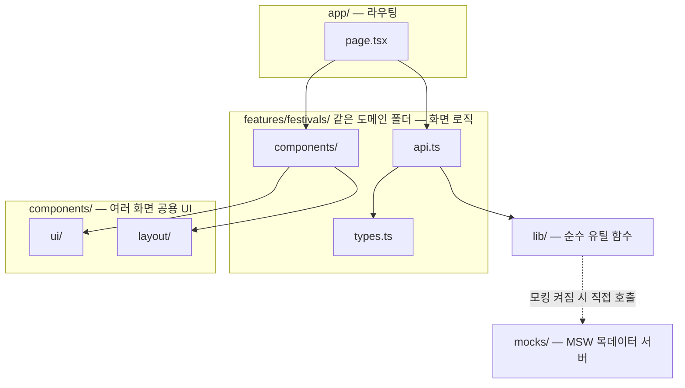
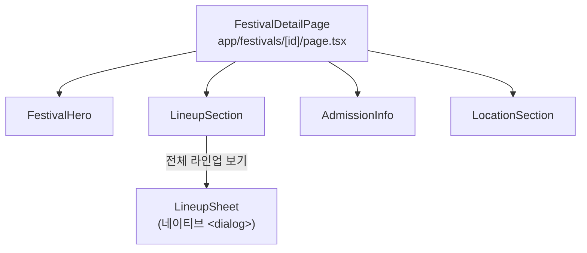
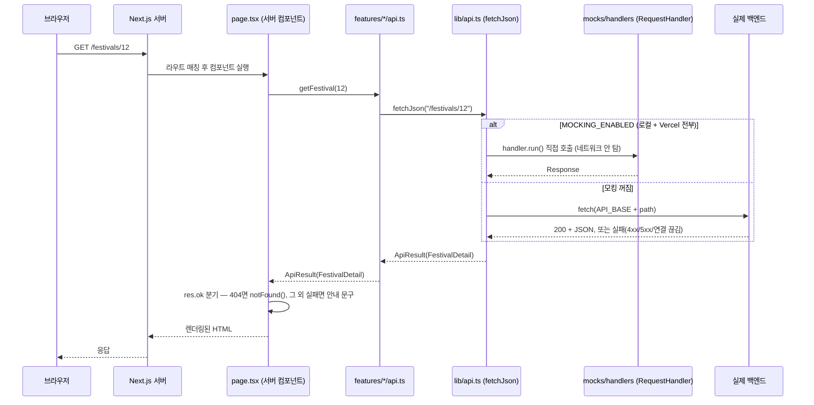

# festa-frontend 아키텍처

컴포넌트 구조, 데이터 흐름, 서버와의 인터페이스를 정리한 기술 문서입니다. 기술적인
질문이 나왔을 때 참고하는 용도로 작성했습니다.

## 1. 개요

- **서비스**: FESTA — 전국 대학 축제·페스티벌 라인업 아카이브
- **스택**: Next.js 16(App Router) · React 19 · TypeScript · Tailwind CSS 4 · pnpm
- **렌더링 전략**: 대부분의 화면이 서버 컴포넌트에서 데이터를 직접 fetch해서 렌더링합니다.
  클라이언트 JS는 정렬 select 제출, 캐러셀 화살표, 바텀시트 열고 닫기처럼 꼭 필요한
  곳에만 최소로 씁니다.
- **데이터 소스(현재)**: 실제 백엔드가 아니라 MSW(Mock Service Worker)로 응답을
  대체하고 있습니다. 자세한 내용은 [4장](#4-서버와의-인터페이스-api-계약)을 참고하세요.

## 2. 컴포넌트 구조

### 레이어



| 레이어 | 역할 | 강제 여부 |
|---|---|---|
| `app/` | URL ↔ 화면 연결. `page.tsx`는 데이터를 가져와서 배치만 하는 얇은 껍데기 | Next.js 프레임워크가 강제(폴더 구조 = URL 구조) |
| `features/<domain>/` | 그 화면의 실제 데이터 페칭(`api.ts`)·타입(`types.ts`)·컴포넌트(`components/`) | 팀 컨벤션 |
| `components/ui`, `components/layout` | 2곳 이상에서 재사용되는 공용 UI. 처음엔 `features` 안에서 화면 전용으로 만들고, 재사용처가 생기면 승격 | 팀 컨벤션 |
| `lib/` | 화면과 무관한 순수 계산 함수(날짜 포맷, D-day 계산, 열거값→한글 매핑 등)와, 서버·클라이언트 요청 계약을 정의하는 `api.ts`(`fetchJson`) | 팀 컨벤션 |

무엇을 어디에 두는지(파일별 배치 기준)는 [`folder-structure.md`](./folder-structure.md)가
정본이다 — 이 표는 그 판단을 다시 정의하지 않고, 레이어 간 호출 방향만 보여준다. 예를 들어
백엔드 응답 타입은 여러 도메인이 공유하는 것만 `types/api.ts`(현재 `PageResponse<T>` 하나)에
있고, 도메인 전용 응답 타입은 folder-structure.md 그대로 `features/<domain>/types.ts`에 있다.

### 예시: 축제 상세 화면(`/festivals/{id}`)의 컴포넌트 트리



`page.tsx`는 `getFestival(id)`를 호출해 받은 데이터를 네 컴포넌트에 나눠 넘기기만 합니다.
실제 마크업·스타일·인터랙션은 전부 `features/festivals/components/` 안에 있습니다.

## 3. 데이터 흐름

### 페이지 요청 1건의 전체 흐름 (서버 사이드)



### 클라이언트 상호작용(정렬·필터·검색)

정렬 드롭다운이나 검색창은 `<form method="GET">`으로 값을 제출합니다. 즉 클릭/입력이
바로 화면을 바꾸는 게 아니라 **URL 쿼리스트링을 바꾸고, 그 URL로 위 사이클이 처음부터
다시 돕니다.** App Router라 전체 새로고침은 아니고 필요한 부분만 다시 받아옵니다. 이
방식을 쓴 이유는 JS가 없어도(또는 실패해도) 정렬·검색이 동작하게 하기 위해서입니다.

### 실패 처리 계약

`lib/api.ts`의 `fetchJson`이 **서버 컴포넌트가 직접 fetch하는** 화면(공개 화면 전체)의
단일 진입점입니다. 예외를 던지지 않고 결과값 하나로 성공/실패를 표현합니다.

```ts
export type ApiResult<T> =
  | { ok: true; data: T }
  | { ok: false; status: number | null; message: string };
```

관리자 화면(`features/admin/*/api.ts`)은 이 계약을 안 씁니다 — TanStack Query의
`useQuery`가 `isError`를 세우려면 `queryFn`이 실제로 throw해야 하는데, `ApiResult`처럼
에러를 성공 값 안에 담아 resolve하면 `useQuery`가 그걸 성공으로 보고 화면이 `isError`
분기를 못 탑니다. 그래서 관리자 쪽은 의도적으로 `AdminApiError`를 throw하는 별도 계약을
씁니다(`features/admin/festival/api.ts` 상단 주석 참고).

- `status`가 채워져 있으면 서버가 응답은 했다는 뜻(4xx/5xx)
- `status`가 `null`이면 서버에 닿지도 못한 것(연결 실패·타임아웃)

호출부(각 `page.tsx`)는 전부 같은 패턴을 반복합니다: `res.ok`가 거짓이고 `status === 404`면
`notFound()`, 그 외엔 에러를 로그로 남기고 "불러오지 못했습니다" 같은 안내 문구를 보여줍니다.
서버 컴포넌트가 처리하지 않은 예외를 그대로 던지면 화면 전체가 500으로 죽기 때문에, 이
계약으로 실패를 항상 화면 레벨에서 흡수합니다.

### 목킹 계층

`NEXT_PUBLIC_API_MOCKING=true`일 때 목데이터가 켜집니다. 서버 사이드와 클라이언트 사이드가
서로 다른 방식으로 동작합니다.

- **서버 사이드**: `lib/api.ts`의 `fetchJson`이 모킹이 켜져 있으면 네트워크 요청을 아예
  보내지 않고, `mocks/handlers`의 `RequestHandler.run()`을 직접 호출해서 응답을 만듭니다
  (위 시퀀스 다이어그램의 `alt` 분기). 원래는 `src/instrumentation.ts`가 `msw/node`의
  `setupServer()`로 네트워크 레벨에서 fetch를 가로채는 방식이었는데, 이 인터셉션이 Vercel
  서버리스 함수에서는 걸리지 않는 문제가 있어(#75) 인터셉션 자체를 우회하는 지금 방식으로
  바꿨습니다. `instrumentation.ts`는 파일은 남아 있지만 이 경로에서는 더 이상 쓰이지
  않습니다.
- **클라이언트 사이드**: `src/mocks/MockProvider.tsx`가 여전히 원래 방식(Service Worker로
  네트워크 레벨 인터셉션)을 씁니다 — `layout.tsx`가 이 플래그일 때만 감쌉니다.

**이 플래그는 이제 로컬 전용이 아닙니다.** Vercel Production/Preview 환경변수에도
`NEXT_PUBLIC_API_MOCKING=true`로 등록돼 있어서, 배포된 환경도 로컬과 동일하게 목데이터로
동작합니다. 아직 백엔드에 공개 조회 API가 없는 상태에서 실제 배포 화면을 시연 가능하게
만든 변경입니다.

## 4. 서버와의 인터페이스 (API 계약)

### 공통 규칙

- **Base URL**: `NEXT_PUBLIC_API_BASE_URL` 환경변수(기본값 `https://api.festa.kr`)
- **페이지네이션 공통 포맷** (0-based `page`):

  ```ts
  {
    items: T[],
    page: number,
    size: number,
    totalElements: number,
    totalPages: number,
    hasNext: boolean,
    hasPrevious: boolean,
  }
  ```

### 실제 사용 중인 엔드포인트

| 화면 | 요청 | 주요 파라미터 |
|---|---|---|
| 홈 — 다가오는 축제 | `GET /festivals/upcoming` | `limit`(1~50, 기본 12) |
| 홈 — 최근 등록된 축제 | `GET /festivals/recent` | `limit`(1~30, 기본 5) |
| 축제 목록 | `GET /festivals` | `page`, `size`, `sort`(`LATEST`\|`UPCOMING`), `hostId?`, `year?`, `artistId?` |
| 축제 상세 | `GET /festivals/{id}` | — |
| 아티스트 목록 | `GET /artists` | `page`, `size`, `sort`, `genre?`, `q?`(이름·다른 이름 부분 일치 검색) |
| 아티스트 상세 | `GET /artists/{id}` | — |
| 주최 상세 | `GET /hosts/{id}` | — |
| 주최 축제 이력 | `GET /festivals` | `hostId`, `year?`, `page`, `size`, `sort` — 별도 엔드포인트가 아니라 축제 목록 API를 필터링해 재사용 |
| 관리자 로그인 | `POST /admin/auth/login` | `username`, `password` — 위 공개 화면과 달리 `fetchJson`이 아니라 `AdminApiError`를 throw하는 별도 계약(위 「실패 처리 계약」 참고) |

관리자 콘솔의 나머지 화면(축제 심사 등)은 아직 이 표에 없다 — `features/admin/festival/api.ts`가
네트워크를 전혀 안 타고 모듈 스코프 로컬 픽스처를 직접 조작하는 상태라(로그인만 실제
MSW 엔드포인트를 탄다), "서버와의 인터페이스"라고 부를 게 아직 없다.
| 통합 검색 | `GET /search` | `q`, `type`(기본 `ALL`) |

`hostId`/`year`/`artistId`처럼 한 목록 API에 여러 화면이 다른 목적으로 파라미터를 얹는
경우가 있습니다 — 주최 상세의 "축제 이력"과 아티스트 상세의 "더 보기"가 전부 `GET
/festivals`를 재사용합니다.

### 지금 실제로 연동돼 있는가

**아니요, 전부 MSW mock입니다.** 백엔드(Spring Boot)는 관리자용 CRUD API만 구현돼 있고,
위 표의 공개 조회 API는 아직 하나도 열리지 않았습니다. 다만 응답 형식(페이지네이션 7개
필드, 에러 응답 구조 등)은 백엔드 스펙 문서를 먼저 확인하고 미리 맞춰뒀기 때문에, 실제
API가 열리면 `API_BASE`와 각 함수의 요청 경로만 맞으면 그대로 연결되는 구조입니다.

### 알려진 미결 사항

- **정렬 파라미터 형식이 아직 확정되지 않았습니다** — 프론트는 `sort=LATEST`처럼 커스텀
  값을 보내는데, 백엔드에 이미 구현된 다른 목록 API는 Spring 표준 `sort=필드명,방향`
  방식을 씁니다. 두 방식이 다르면 실제 연동 시 정렬 요청이 에러가 날 수 있습니다
  (`festa-frontend` 이슈 [#59](https://github.com/greedy-team/festa-frontend/issues/59)).
