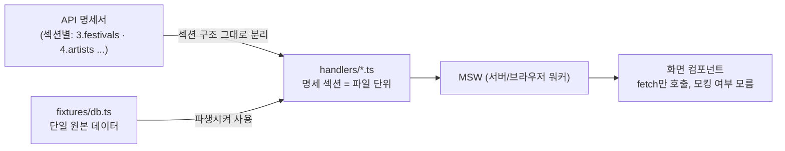

# API 명세 기반 Mocking 구축 방법

백엔드 없이 화면을 먼저 만들기 위해 API 명세서를 기준으로 목데이터 계층(MSW)을 어떻게
설계했는지 정리한 문서입니다. "이거 실제 데이터예요?" 다음에 나올 법한 "그럼 목데이터는
어떻게 만든 거예요?" 질문에 대비하려고 작성했습니다.

원본 결정 기록은 `src/mocks/MOCKING_STRATEGY.md`(ADR 전문)와 `src/mocks/README.md`(구조·
설치·설계 메모)에 있습니다. 이 문서는 그걸 설명하기 좋게 압축한 버전입니다.

## 1. 왜 이 방식이 필요했나

- 2인 체제로 진행하면서 **백엔드 완성을 기다리지 않고 화면을 먼저 만들기로** 했습니다.
- 화면을 만드는 사람과 목데이터를 만드는 사람이 분리돼 있어서, 목데이터는 "대충 만들고
  나중에 버리는 것"이 아니라 **실제 API 응답 모양을 미리 검증하는 수단**이어야 했습니다.
- API 명세서 자체가 여러 버전으로 나뉘어 있었고, 문서마다 필드명·범위·에러코드가 서로
  다른 경우가 실제로 여러 번 발견됐습니다. 목데이터가 "어느 버전을 기준으로 만들어졌는지"가
  불명확하면, 나중에 실제 API가 붙었을 때 왜 이렇게 짜여 있는지 아무도 설명하지 못하는
  상황이 됩니다.

## 2. 핵심 방법



### ① 컴포넌트는 모킹 여부를 모른다 (MSW)

컴포넌트는 평소처럼 `fetch()`를 부르고, 목데이터를 받는지 실제 API를 받는지 알 방법이
없습니다 — 그래서 실제 백엔드로 전환할 때 컴포넌트 코드를 한 줄도 안 고치고 환경변수
두 개(`NEXT_PUBLIC_API_MOCKING`, `NEXT_PUBLIC_API_BASE_URL`)만 바꾸면 됩니다.

실제로 요청을 가로채는 방식은 서버/클라이언트가 다릅니다.

- **클라이언트 사이드**: MSW의 Service Worker가 네트워크 레벨에서 진짜로 가로챕니다.
- **서버 사이드**: 처음엔 `msw/node`로 네트워크 레벨에서 가로채는 방식이었는데, 이 방식이
  Vercel 서버리스 함수에서는 인터셉션이 안 걸리는 문제가 있었습니다. 그래서 지금은
  네트워크를 아예 안 타고, MSW handler의 `RequestHandler.run()`을 직접 호출해서 응답을
  만드는 방식으로 바꿨습니다 — 실행 환경(로컬/Vercel)에 의존하지 않습니다. 자세한 내용은
  [`docs/architecture.md`](./architecture.md#목킹-계층)를 참고하세요.

대안으로 "컴포넌트에 더미 데이터를 직접 박아넣기"나 "별도 목업 서버(json-server 등)
띄우기"도 검토했지만, 전자는 나중에 API 연동 시 컴포넌트를 전부 다시 고쳐야 하고, 후자는
Next.js의 서버 컴포넌트가 서버(Node)에서 직접 fetch하는 부분까지 자연스럽게 커버하기
어려워서 기각했습니다.

### ② 데이터는 한 곳에만 두고, 나머지는 거기서 파생시킨다

`fixtures/db.ts` 하나에 축제·아티스트·학교 원본 데이터를 두고, 모든 handler가 여기서
파생시킵니다. 축제의 라인업도 아티스트를 이름이 아니라 `artistId`로 참조합니다(관계형
DB의 외래키와 같은 개념). 데이터를 여러 파일에 중복해서 넣으면 하나만 고치고 나머지를
놓치는 실수가 나기 쉽고, "축제 상세에서 본 아티스트를 눌렀을 때 그 아티스트 상세로 실제로
이동하는지" 같은 화면 간 이동 검증이 이 구조 덕분에 항상 정합성을 유지합니다.

### ③ 명세서의 섹션 구조를 파일 구조로 그대로 옮긴다

```
handlers/
  festivals.ts   # 명세서 3장 (3.1~3.5)
  artists.ts     # 명세서 4장 (4.1~4.2)
  hosts.ts       # 명세서 5장 (5.1)
  search.ts      # 명세서 7장 (7.1~7.2)
```

명세서 어느 조항을 보고 있는지와 코드 어느 파일을 보고 있는지가 항상 1:1로 대응되게
했습니다. 실제 handler 코드에도 조항 번호를 그대로 주석으로 남겨뒀습니다.

```ts
export const festivalsHandlers = [
  // 3.1 GET /festivals
  http.get(`${API}/festivals`, ({ request }) => {
    // ... 파라미터 검증, 필터링, 페이지네이션
  }),
];
```

여러 도메인이 공통으로 필요한 계산은 `fixtures/` 아래 헬퍼로 따로 뺐습니다.

| 파일 | 역할 |
|---|---|
| `pagination.ts` | 페이지네이션 계산 공통화 |
| `errors.ts` | 에러 응답 생성 공통화(필드명이 바뀌면 여기 한 곳만 고치면 10개 엔드포인트 전체에 반영) |
| `date.ts` | 오늘 날짜·D-day·축제 상태(예정/진행중/종료) 계산의 단일 기준 |
| `appearances.ts` | 아티스트 출연 이력 계산 — `artists.ts`와 `search.ts`가 같이 써서 두 화면의 출연 횟수가 항상 일치 |

### ④ 명세가 확정된 것부터, 불확실한 건 뒤로 미룬다

festivals/artists/hosts/search 10개 엔드포인트를 먼저 구현하고, 분실물(퀴즈 인증 흐름이
있어 복잡하고 우선순위가 낮음)과 관리자 화면(프론트 스코프 자체가 다름)은 뒤로 미뤘습니다.
분실물 API는 작업 초반엔 명세에 아예 없다가 나중에 확정됐는데, 확정 전에 추측해서 미리
만들었다면 확정 후 다시 갈아엎어야 했을 부분입니다 — 명세가 흔들리는 영역을 먼저 손대는
게 오히려 총비용을 늘린다는 걸 이번에 실제로 확인했습니다.

### ⑤ 문서끼리 서로 다르면, 주제별로 "기준 문서"를 정해둔다

같은 스펙이 문서마다 다르게 적힌 경우가 여러 번 나왔습니다(에러 필드명, 에러코드 철자,
파라미터 유효 범위 등). 그때그때 임의로 고르지 않고 주제별로 기준을 나눠 정했습니다.

| 주제 | 기준 문서 |
|---|---|
| 에러 코드 이름·철자 | 에러 코드 마스터 문서(v1) |
| 그 외 필드 구조·파라미터 정의 | 검토 태그가 붙은 개별 페이지 export |

기준 문서 안에서도 자체 모순이 있는 항목(예: 특정 파라미터의 유효 범위)은 임의로 정하지
않고, 코드에 주석으로 "팀 확인 대기"라고 남겨뒀습니다 — 추측으로 채우지 않는다는 원칙을
지키기 위해서입니다.

## 3. 예상 질문

**"이거 나중에 실제 API 붙으면 다시 다 짜야 하나요?"**
아니요. 컴포넌트는 MSW가 가로챈 응답인지 실제 API 응답인지 모르는 구조라서, 환경변수
두 개만 바꾸면 전환됩니다. 화면 코드는 그대로 둡니다.

**"명세서랑 다르게 구현된 부분도 있어요?"**
네, 문서 간 표기가 서로 달랐던 항목 몇 개는 기준 문서를 정해서 그쪽을 따랐고, 그 문서
안에서도 모순이 있던 항목(파라미터 유효 범위 하나)은 아직 팀 확인 대기 상태로 코드
주석에 남아 있습니다. 추측으로 채우지 않았다는 게 핵심입니다.

**"왜 json-server 같은 걸 안 쓰고 MSW를 썼어요?"**
Next.js 서버 컴포넌트는 브라우저가 아니라 서버(Node)에서 직접 fetch를 실행하는데, MSW는
`msw/node`와 `msw/browser` 양쪽을 다 지원해서 이 부분까지 자연스럽게 가로챌 수 있습니다.
별도 목업 서버는 이 경로를 커버하려면 추가 설정이 더 필요했을 거예요.

**"목데이터 응답에 화면에서 안 쓰는 필드가 있던데요?"**
있었습니다 — 주최(host) 정보에 붙는 `type` 필드예요. 주최 상세 화면 작업 때 "확정된
ERD에 없는 필드"로 결론이 나서 화면 쪽은 처음부터 참조하지 않았지만, 그 결론이
목데이터 응답·프론트 타입 선언에는 한동안 반영이 안 된 채로 남아 있었습니다. 전체
경위와 제거 범위는 `src/mocks/MOCKING_STRATEGY.md`의 "5. 갱신"이 정본입니다 —
실제 제거는 문서 정리와 별개의 코드 변경이라 #125/PR #126에서 다룹니다.

## 4. 한계 (솔직하게)

- 분실물 화면은 아직 목데이터가 없습니다. 관리자는 로그인(`POST /admin/auth/login`)만
  이 MSW 구조를 그대로 쓰고, 그 이후 화면(축제 심사 등)은 `features/admin/festival/api.ts`가
  네트워크를 아예 안 타고 모듈 스코프 로컬 픽스처를 직접 조작하는 별도 방식입니다 — MSW
  핸들러가 없습니다.
- D-day 같은 날짜 계산이 실제 `new Date()` 기준이라, 시간이 지나면 축제 상태(예정/진행중/
  종료)가 자연히 바뀝니다 — 스냅샷 테스트를 붙이려면 "오늘"을 고정하는 작업이 별도로
  필요합니다.
- 검색 매칭은 단순 문자열 포함(`includes()`) 기반이라, 실제 검색엔진의 랭킹·형태소 분석
  동작까지는 흉내내지 않습니다. 화면이 검색 타입별 분기를 잘 처리하는지 확인하는 용도로
  범위를 한정했습니다.
