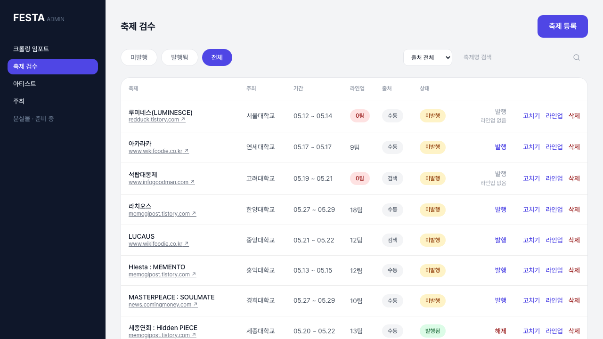

### 📌 작업 개요

사용자 화면 E2E(#115)에 이어, 로그인 없이는 접근할 수 없는 관리자 화면(로그인·가드·축제 검수)을 같은 Playwright 인프라로 커버했다.

이 브랜치는 2026-08-30에 한 번 완성됐다가(PR #124) 그 사이 #122가 관리자 콘솔을 실 API 연동(`adminFetch`)으로 바꾸면서 검수 스펙이 깨졌다 — 스펙이 기대던 로컬 픽스처(`adminFestivalsFixture`)와 체크박스·일괄 발행 UI가 전부 사라졌기 때문이다(#122 리포트의 「남은 것」이 예고한 그대로). develop을 머지한 뒤 검수 스펙과 목 계층을 현재 화면 기준으로 다시 만들었다. 로그인·가드 스펙은 그대로 통과해 손대지 않았다.

### 🎯 구현 목표

- 관리자 로그인 성공/실패
- 비로그인 상태의 콘솔 접근 차단(`AdminGuard`)
- 축제 검수: 발행 / 발행 해제 / 발행 조건 미충족(차단)

### ✅ 구현 내용

#### 관리자 로그인 (`admin-login.spec.ts`, 변경 없음)
- 잘못된 자격증명 → 에러 문구(`아이디 또는 비밀번호가 올바르지 않습니다.`) 확인. `role="alert"`가 Next.js의 route announcer와 겹쳐 `p[role="alert"]`로 좁혔다
- 올바른 자격증명(mock 계정 `admin`/`admin`, `src/mocks/handlers/adminAuth.ts`) → `/admin/festivals`로 이동, `축제 검수` 헤딩 확인

#### 콘솔 접근 가드 (`admin-guard.spec.ts`, 변경 없음)
- 토큰 없는 새 브라우저 컨텍스트로 `/admin/festivals` 직접 접근 → `/admin/login`으로 리다이렉트 확인

#### 축제 검수 (`admin-festival-review.spec.ts`, 재작성)
- 전체 목록에서 **활성화된 `발행` 버튼이 있는 첫 행**의 이름을 읽고 발행 → 같은 이름의 행이 `발행됨` 배지 + `해제` 버튼으로 바뀌는지
- 전체 목록에서 **`해제` 버튼이 있는 첫 행**의 이름을 읽고 해제(`window.confirm` 수락) → 같은 행이 `미발행` 배지 + `발행` 버튼으로 바뀌는지
- 미발행 필터에서 **비활성 `발행` 버튼이 있는 첫 행**에 차단 사유 문구(`라인업 없음`·`주최 미연결`·`좌표 없음` 중 하나)가 보이고, force 클릭해도 상태가 그대로인지
- 축제명은 하드코딩하지 않는다(#115의 규칙). 전제는 픽스처 첫 페이지에 세 경우가 모두 있다는 것 하나이고, 깨지면 스킵이 아니라 실패다

#### 관리자 검수 MSW 핸들러 (`src/mocks/handlers/adminFestivals.ts`, 신규)
- 화면이 실제로 부르는 세 엔드포인트만: `GET /admin/festivals`(published·discovery·q·page·size), `POST`/`DELETE /admin/festivals/{id}/publish`(멱등)
- 발행 상태는 모듈 스코프에 둔다. 페이지 전체 로드마다 초기화되므로 테스트 간 격리는 `page.goto`로 끝난다
- 에러 계약(size 51 → `INVALID_PAGE_SIZE`, page -1 → `INVALID_PAGE`, 없는 id → `FESTIVAL_NOT_FOUND`)은 실서버 실측과 같다

#### 실서버 응답 캡처 픽스처 (`src/mocks/fixtures/adminFestivals.ts`, 신규)
- 2026-09-05 실서버 `GET /api/admin/festivals?page=0&size=50` 응답 24건을 **그대로** 옮겼다(백엔드 `origin/develop` 88eb9d9, `api-docs.json` e76fe40). 첫 페이지 10건 안에 발행 가능 미발행(7)·발행 차단(2, `LINEUP_EMPTY`)·발행됨(1)이 다 있다
- `AdminFestival[]`로 선언한 것 자체가 「서버 응답 ↔ 프론트 타입」 대조다 — 서버 필드가 바뀌면 다음 캡처에서 컴파일이 깨진다. 계정은 코드에 두지 않았고 다시 뜨는 방법만 파일 머리에 적었다

#### 문서
- `src/mocks/MOCKING_STRATEGY.md` §5에 2026-09-05 항목 추가(admin 핸들러 편입, db.ts 파생이 아닌 이유, `bypass`로 새던 문제)
- `src/mocks/README.md` 핸들러 목록과 관리자 화면 서술 갱신

### 🧭 결정 기록 (ADR)

#### 실서버를 때리는 대신, 실서버 응답을 떠와서 MSW로 돌린다
- **문제**: 검수 화면이 실 API로 바뀌어 E2E가 붙을 데이터가 없어졌다. 선택지는 셋 — ① 실서버에 직접 붙는다 ② 프론트가 `db.ts`에서 조립한 목 응답을 만든다 ③ 실서버 응답을 한 번 떠와 MSW 픽스처로 쓴다
- **①을 버린 이유**: 서버가 `api.every-festa.com` 하나뿐이라 발행 테스트가 진짜 축제를 공개 화면에 띄운다. "미발행이고 조건 되는 축제"가 서버에 남아 있어야 테스트가 되니 운영자 조작에 따라 깨지고, PR 두 개가 동시에 CI를 돌면 서로 간섭한다. CI에는 백엔드가 없다는 #115의 구조(`webServer.env`로 목 강제)와도 어긋난다
- **②를 버린 이유**: 목과 타입을 같은 손으로 만들면 `tsc` 초록이 계약의 근거가 되지 않는다. #139에서 실제로 절반이 계약과 어긋난 채 초록이었다
- **선택**: ③. 서버가 실제로 내려준 모양을 픽스처로 고정하고, 발행/해제는 그 픽스처의 `publishedAt`만 바꾸는 핸들러로 처리한다. `MOCKING_STRATEGY.md` 2.2의 단일 소스(`db.ts`) 원칙은 사용자 화면 간 id 정합성(라인업 ↔ 아티스트)을 위한 것이라 관리자 검수 목록에는 적용 이유가 없다 — 문서에 그 판단을 적었다
- **트레이드오프**: 서버 계약이 바뀌어도 이 픽스처는 자동으로 따라가지 않는다. 다시 캡처하는 절차를 파일 머리에 남겼고, 서버 계약 자체의 검증은 백엔드 테스트의 몫이다

#### 이슈 본문의 두 전제는 현재와 맞지 않아 정정한다
- **「발행/반려」**: 반려는 지금 화면에도 API 계약에도 없다. 발행 여부는 `publishedAt` 하나로만 판정하고(#55) 존재하는 전이는 발행과 해제뿐이라, 반려 자리를 **해제**로 채웠다
- **「테스트 계정을 CI 시크릿으로」**: CI에는 백엔드가 없고 목 모드가 강제되므로 계정은 MSW의 `admin`/`admin`이고 시크릿이 필요 없다. 실서버 계정은 픽스처 캡처에 로컬에서 한 번 썼을 뿐 어디에도 남기지 않았다

#### 해제 검증은 「발행됨」 필터가 아니라 전체 목록에서 한다
- 필터 안에서 해제하면 행이 목록에서 빠져 "사라졌다"만 남는다 — 렌더 실패와 구분이 안 된다(#115 리뷰가 세 번 잡은 형태). 전체 목록에서는 같은 행이 `미발행`으로 바뀌는 것을 그 자리에서 본다
- 처음엔 필터에서 해제한 뒤 `전체` 칩으로 옮겨 확인하려 했으나, 해제 직후 빈 목록 상태에서 `전체` 칩(`next/link`, `href="/admin/festivals"`) 클릭이 URL을 바꾸지 않았다. 같은 빌드에서 첫 로드 직후의 `미발행` 칩 클릭은 정상적으로 소프트 내비게이션됐다. 재현 조건을 좁히지 못해 **이 PR의 범위 밖 관찰**로만 남긴다 — `?published=true`에서 쿼리 없는 같은 경로로 가는 경우인지, 뮤테이션 직후인지 확인이 필요하다

### 🧪 테스트 및 검증

- `pnpm exec tsc --noEmit`, `pnpm lint`(기존 경고 1건 외 없음), `pnpm test` 유닛 74건 통과
- `pnpm exec playwright test` — 17건 중 16 통과, 1 스킵(`artist-detail-upcoming-show`, 목 데이터에 예정 공연이 없어 스킵되는 #115의 기존 케이스). 관리자 6건(로그인 2·가드 1·검수 3) 전부 통과
- **테스트가 정말 잡는지 확인했다** — 가드를 일부러 지우고 빨개지는지 본 뒤 되돌렸다
  - `FestivalReviewTable`의 `disabled={hasBlockers || isPublishing}`에서 `hasBlockers`를 빼면 → 차단 시나리오 실패
  - 핸들러의 `setPublished`가 `publishedAt`을 안 바꾸면 → 발행·해제 시나리오 실패
- 첫 실행에서 `/admin/festivals` 스크린샷으로 대상이 우리 앱인지 확인했다(#115에서 무관한 서버에 붙었던 사고의 재발 방지)

#### 결과물 (발표·기록용)

`test-results/`·`playwright-report/`는 매 실행마다 바뀌어 gitignore 그대로 두고, 이 시점의 결과만 골라 `docs/reports/assets/116/`에 남긴다.

- [`playwright-report.html`](./assets/116/playwright-report.html) — 2026-09-05 전체 스위트 실행 리포트(16 통과 · 1 스킵). 단일 HTML이라 그대로 열린다
- [`admin-festivals.png`](./assets/116/admin-festivals.png) — 목 모드 검수 화면. 실서버 캡처 픽스처가 그대로 그려진 상태

### 📌 참고사항

- **목 모드에서 관리자 요청이 프로덕션으로 새고 있었다.** `MockProvider`가 `onUnhandledRequest: 'bypass'`라 핸들러 없는 요청은 실서버로 나간다. 이번 E2E에서 목 토큰으로 `api.every-festa.com`을 때려 401을 받고 로그인으로 튕기는 형태로 드러났다. 검수 화면은 이번에 핸들러를 채워 막았지만 아티스트·주최·라인업·임포트 화면은 여전히 그 상태다 — `bypass`를 `error`로 바꿀지는 별도 이슈로
- 픽스처는 실서버 스냅샷이라 사용자 화면 목(`db.ts`)과 id를 공유하지 않는다. 관리자 검수 화면은 사용자 화면으로 링크하지 않으므로 지금은 문제가 없다
- 로컬에서 처음 돌리면 Chromium이 없다 — `pnpm exec playwright install chromium`
