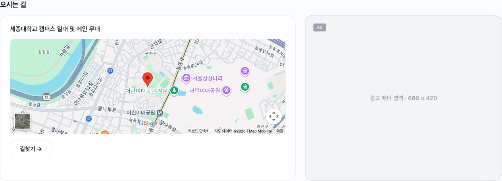

# 축제 상세 오시는 길 구글 맵 임베드

### 📌 작업 개요

축제 상세 "오시는 길" 섹션의 `지도 준비 중입니다` 폴백 박스를 실제 지도로 교체.
Google Maps Embed API iframe으로 축제 좌표에 마커를 찍는다. 저장소 밖 작업(구글 클라우드
프로젝트·결제 계정·API 키·Vercel 환경변수)도 이 이슈 범위였고 함께 마쳤다.

### 🎯 구현 목표

오시는 길은 지도와 외부 길찾기 링크로만 구성하기로 확정돼 있어 지도가 그 섹션의 유일한
시각 요소다. 키와 결제 계정이 저장소 안에서 만들 수 있는 것이 아니라 축제 상세 화면 이슈
(#43)에서 분리돼 있었고, 그쪽은 지도 자리를 폴백 박스로 남긴 채 먼저 나갔다.

### ✅ 구현 내용

#### 지도 임베드

- **파일**: `src/features/festivals/components/LocationSection.tsx`
- **변경 내용**: 폴백 박스를 `https://www.google.com/maps/embed/v1/place?key={API_KEY}&q=<위도>,<경도>`
  iframe으로 교체. 높이 240px·`rounded-md`는 기존 박스 값을 그대로 유지
- **이유**: 좌표만으로 위치 표시와 마커가 동시에 해결된다. `q`에 좌표를 넣으면 마커가 자동으로 찍힌다

#### 폴백 경로 유지

- **파일**: 같은 파일
- **변경 내용**: `hasCoordinates && MAPS_KEY` 조건. 좌표가 `null`이거나 키가 없으면 기존 폴백 박스를 그대로 그린다
- **이유**: 계약상 `latitude`/`longitude`는 nullable이고, 키 없이 도는 로컬 환경이 깨진 iframe 대신 회색 박스를 보게 한다

#### 저장소 밖 설정

- Google Cloud 프로젝트에 **Maps Embed API만** 활성화, API 키 발급
- 키에 **HTTP 리퍼러 제한** 4건: `http://localhost:3000/*` · `https://every-festa.com/*` ·
  `https://*.every-festa.com/*` · `https://*.vercel.app/*`
- 키에 **API 제한**: Maps Embed API 단일 선택
- Vercel 환경변수 `NEXT_PUBLIC_GOOGLE_MAPS_KEY`를 Production·Preview·Development 전부에 등록 (Config 타입)

### 🧭 결정 기록 (ADR)

#### 지도 렌더에 Maps Embed API를 쓴다 (JavaScript API 아님)

- **문제**: 구글 맵을 붙이기로 확정돼 있었으나 어느 API를 켤지는 정해져 있지 않았다
- **선택**: Maps Embed API. iframe 한 줄이고 라이브러리를 설치하지 않는다
- **대안**:
  - **Maps JavaScript API** — 지도를 코드로 제어할 수 있지만 우리는 좌표 한 점에 마커만 찍는다.
    로드 호출마다 과금되고 `@vis.gl/react-google-maps` 같은 래퍼 의존성이 따라온다
  - **Maps Static API** — 더 싸지만 이미지라 확대·이동이 안 된다. 장소를 확인하러 온 사용자에게 정지 이미지는 부족하다
  - **Places API** — 장소 상세 정보용. `placeId`를 두지 않기로 확정돼 있어 애초에 쓸 값이 없다
- **트레이드오프**: 마커 커스터마이징·클릭 인터랙션이 필요해지면 JavaScript API로 갈아타야 한다.
  지금은 위치 렌더 전용이라 그 요구가 없다
- ⭐ **볼트 승격 권장** — 비용·의존성이 걸린 외부 서비스 선택이고, 나중에 "왜 SDK를 안 썼지"가 나올 자리

#### 키가 없으면 폴백 박스로 되돌아간다

- **문제**: 키는 Vercel과 각자의 `.env.local`에만 있다. 키 없이 받은 사람이 축제 상세를 열면 무엇을 볼 것인가
- **선택**: 키가 없으면 원래의 회색 폴백 박스를 그대로 그린다
- **대안**: 조건 없이 iframe을 그리는 안 — 키 없는 요청은 구글이 에러 화면을 돌려주고, 그게 화면 안에 박힌다
- **트레이드오프**: 조건이 하나 늘었다. 다만 폴백 박스는 어차피 좌표 `null` 때문에 남겨야 하는 코드다

### 🧪 테스트 및 검증

- `pnpm exec tsc --noEmit` · `pnpm exec eslint` 통과
- `pnpm test` — 유닛 74건 통과 (13파일)
- `pnpm test:e2e` — 17건 중 16 통과, 1 스킵(`artist-detail-upcoming-show`, 목 데이터에 예정 공연이 없는 기존 케이스).
  **축제 상세를 지나는 3건**(`home-to-festival-detail`·`festivals-sort`·`host-history`)이 실제 iframe이 붙은 화면에서 통과했다
- **실 API 데이터로 눈으로 확인했다** — `/festivals/8`(세종연회) 좌표에 마커가 찍히고, 리퍼러 제한이 걸린 키가 `localhost:3000`에서 정상 동작
- **375px 실측** — 지도가 폭에 맞고 길찾기 버튼 정상
- **폴백 경로는 육안 확인하지 못했다.** 좌표가 `null`인 발행 축제가 실 API에 없고, 키를 비우려면 돌고 있는 개발 서버를 내려야 했다. 조건식 자체는 단순하나 확인은 남는다

#### 결과물 (발표·기록용)

`test-results/`·`playwright-report/`는 매 실행마다 바뀌어 gitignore 그대로 두고, 화면 캡처만
`docs/reports/assets/48/`에 남긴다. 이 작업은 E2E 스펙을 추가하지 않았고 실행은 회귀 확인이라
리포트 HTML은 따로 보존하지 않는다.

- [`festival-detail-map-1440.png`](./assets/48/festival-detail-map-1440.png) — 1440px 오시는 길 섹션. 실 API 데이터(세종연회), 지도 우측은 광고 슬롯
- [`festival-detail-map-375.png`](./assets/48/festival-detail-map-375.png) — 375px 실측. 지도·광고가 세로로 스택된다

### 📌 참고사항

- **키는 브라우저에 그대로 노출된다.** `NEXT_PUBLIC_` 접두어가 붙은 값은 빌드 산출물에 인라인되고,
  프론트엔드 저장소는 공개다. 그래서 리퍼러 제한과 API 제한이 실질적인 방어선이다 — 둘 중 하나라도
  풀면 남이 우리 계정으로 호출할 수 있다
- **Vercel 프리뷰 도메인은 배포마다 URL이 바뀐다.** 리퍼러에 `https://*.vercel.app/*` 와일드카드가
  없으면 프리뷰에서만 지도가 안 뜬다
- 환경변수를 추가한 뒤에는 **재배포해야 반영된다.** 빌드 타임에 값이 박히므로 기존 배포는 그대로다
- Maps Embed API는 과금 대상이 아니지만, 콘솔에서 다른 Maps API가 함께 켜져 있다. 키의 API 제한이
  Embed 하나로 묶여 있어 이 키로는 다른 API를 호출할 수 없다
