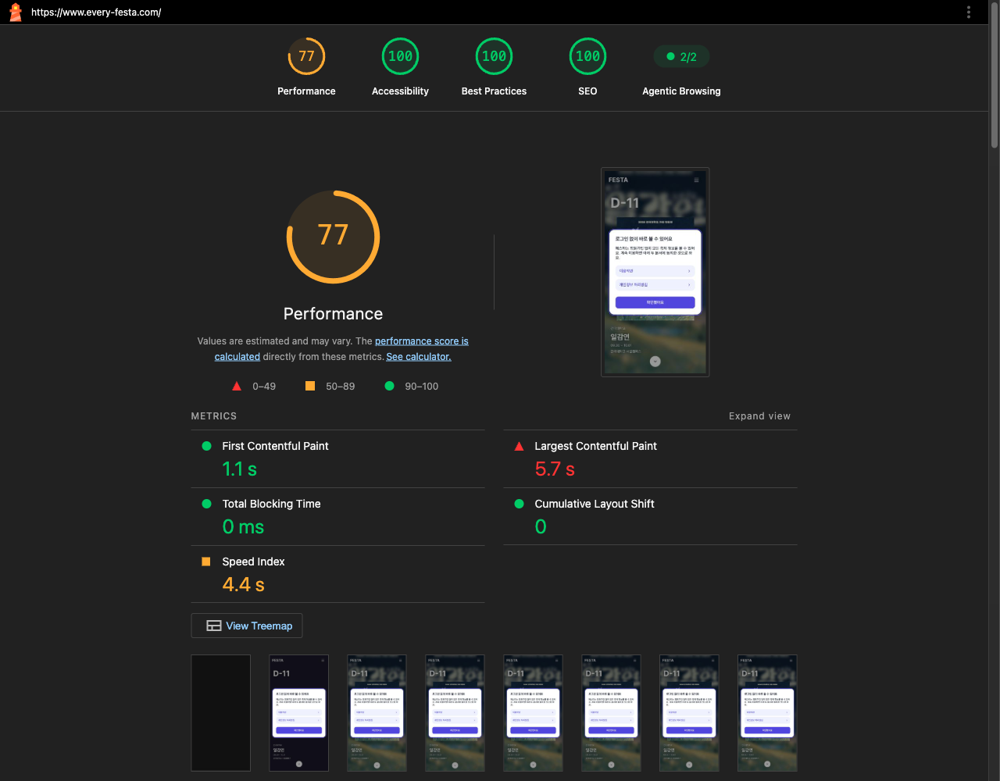
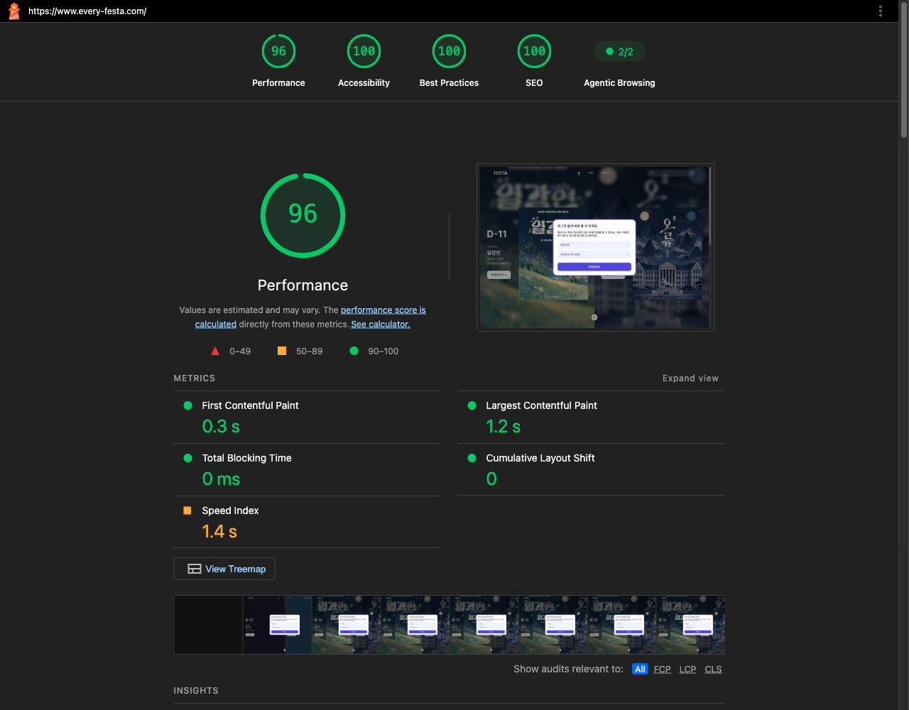

### 📌 작업 개요
운영 홈 모바일 Lighthouse Performance 76점·LCP 7.52초 문제를 분석해 히어로 첫 포스터에 `fetchpriority=high`를 부여. 회귀 테스트로 힌트 누락·전 슬라이드 확산을 막고, 배포 전 모바일·데스크톱 기준선을 확장 프로그램 없는 헤드리스 Chrome으로 5회씩 측정해 보존.

### 🔍 문제 분석
- 운영 홈 모바일 Lighthouse(5회 중앙값): Performance 76점, LCP 7.52초. `lcp-discovery-insight` 검사가 5회 모두 실패했고, 실패 항목은 정확히 하나 — `fetchpriority=high` 힌트 부재. 초기 문서에서 요청을 찾을 수 있는지, lazy 로딩이 아닌지는 이미 통과.
- LCP 4단계 분해에서 `resourceLoadDelay`가 관측 합계의 약 60%(5회 중앙값 794ms)를 차지. 첫 바이트 64ms, 렌더링 지연 35ms로 나머지 구간은 이미 짧음.
- 원인: 히어로 캐러셀이 포스터마다 동등한 preload를 만든다. React 19가 ``를 자동으로 `<link rel="preload" as="image">`로 문서에 끌어올리기 때문에, 문제는 preload의 부재가 아니라 **전부 동등해서 서로 대역폭을 다투는 것**이었다. 운영 HTML에는 동등한 preload 5개(약 900KB)가 있었고, 첫 화면에 보이는 포스터가 보이지 않는 뒤 슬라이드와 경쟁했다.

### ✅ 구현 내용

#### PosterImage에 우선순위 옵션 추가
- **파일**: `src/components/ui/PosterImage.tsx`
- **변경 내용**: `priority` prop 추가, `true`일 때 ``에 `fetchPriority="high"` 부여
- **이유**: 브라우저가 스스로 매기는 네트워크 priority와 별개로, 이 힌트는 요청 "시작 시점"을 앞당긴다 — resourceLoadDelay 구간을 직접 겨냥한 조치

#### HeroPanel이 옵션을 두 곳에 전달
- **파일**: `src/features/home/components/HeroPanel.tsx`
- **변경 내용**: `priority` prop을 받아 흐린 배경용 `PosterImage`와 전면 원본용 `PosterImage` 둘 다에 전달
- **이유**: 첫 패널은 같은 포스터를 배경(blur)과 전면(원본) 두 번 그리는데, 주소가 같아 브라우저는 요청을 하나만 보낸다 — 두 곳 모두 같은 우선순위를 줘야 어느 쪽이 트리거하든 동일하게 동작

#### Hero에서 첫 패널에만 활성화
- **파일**: `src/features/home/components/Hero.tsx`
- **변경 내용**: `<HeroPanel priority={i === 0} />` — 캐러셀의 첫 슬라이드에만 켠다
- **이유**: 첫 화면에 보이지 않는 뒤 슬라이드까지 높은 우선순위를 주면 다시 서로 경쟁하게 되어 원래 문제가 재발한다

### 🔧 주요 변경사항 상세

#### heroPriority.test.tsx (회귀 테스트)
`renderToStaticMarkup`으로 렌더 결과를 문자열로 받아 `<link rel="preload" as="image">`와 `` 태그를 직접 센다. 화면으로는 드러나지 않는 변경이라 렌더 결과에서 직접 검증하는 방식을 택했다.

- 축제 3건: preload 3개(React가 자동 생성) 중 `fetchpriority="high"`는 1개만, 그 URL이 첫 축제 포스터인지 확인
- `fetchpriority="high"`가 붙은 ``가 정확히 2개(배경+전면)이고 둘 다 같은 URL인지 확인
- 축제 1건(캐러셀 없음)에서도 그 하나의 포스터가 high로 표시되는지 확인

**특이사항**:
- 두 테스트 모두 "힌트가 조용히 빠지는 경우"와 "전 슬라이드로 번지는 경우"를 각각 잡아내도록 개수를 정확히 검증한다(힌트 부재·과잉 부여 둘 다 회귀로 간주).

### 🧭 결정 기록 (ADR)

해당 없음 — 기존 패턴을 그대로 따랐습니다.

### 🧪 테스트 및 검증

#### 로컬 검증
- 회귀 테스트 2건 통과. 힌트 제거·전체 패널 적용으로 각각 돌연변이 검증해 실패하는 것을 확인
- **개발 기기에서는 resourceLoadDelay 구간 자체가 4~5ms 수준이라 로컬 전후 비교로 개선 크기를 측정할 수 없다.** 로컬에서 확정되는 것은 discovery 검사가 FAIL→PASS로 바뀐다는 사실(5/5 재현)까지

#### 배포 전 운영 기준선 측정 (`docs/analyzes/lcp-priority/`)
- 확장 프로그램 없는 헤드리스 Chrome(Lighthouse CLI 13.4.1/13.5.0)으로 모바일·데스크톱 각 5회 측정, 중앙값 대표값 사용
- 모바일: Performance 76(5회 중앙값), LCP 7.52초, resourceLoadDelay 794ms, discovery 검사 5회 모두 실패
- 데스크톱: Performance 94(5회 중앙값), LCP 1.24초 — 이미 양호한 상태
- **측정 조건 주의**: 확장 프로그램이 설치된 일반 브라우저로 재측정하면 그 확장이 남기는 `chrome-extension://` 요청 때문에 서드파티 쿠키·DevTools Issue 감사가 실패해 Best Practices 점수가 실제보다 낮게 잡힌다(확장 있을 때 77점 vs 없을 때 100점, 코드는 동일 — 2026-09-15 초기 진단에서도 같은 현상 확인). before/after 비교는 항상 같은 깨끗한 조건에서 해야 한다

#### 결과물 (발표·기록용)
- `docs/analyzes/lcp-priority/README.md` — 측정 방법론과 조건 주의사항
- `docs/analyzes/lcp-priority/prod-before-{1..5}.json` — 배포 전 모바일 5회 원본
- `docs/analyzes/lcp-priority/prod-before-desktop-{1..5}.json` — 배포 전 데스크톱 5회 원본
- `docs/analyzes/lcp-priority/prod-before-mobile-score.png`, `prod-before-desktop-score.png` — 전체 카테고리 점수 화면
- `docs/analyzes/lcp-priority/prod-before-mobile-site.jpg`, `prod-before-desktop-site.jpg` — Lighthouse가 캡처한 사이트 화면

### 📌 참고사항
- 코드 변경은 커밋됐지만(PR #253, CI 통과) **아직 미머지** 상태다. `develop → main` 배포 전이라 프로덕션 코드에는 아직 우선순위 힌트가 없다.
- 개선 크기는 아직 확정되지 않았다. 배포 후 동일 조건(확장 프로그램 없는 헤드리스 Chrome, 5회 측정)으로 `prod-after-*` 접두 파일을 추가해 전후를 비교해야 한다.
